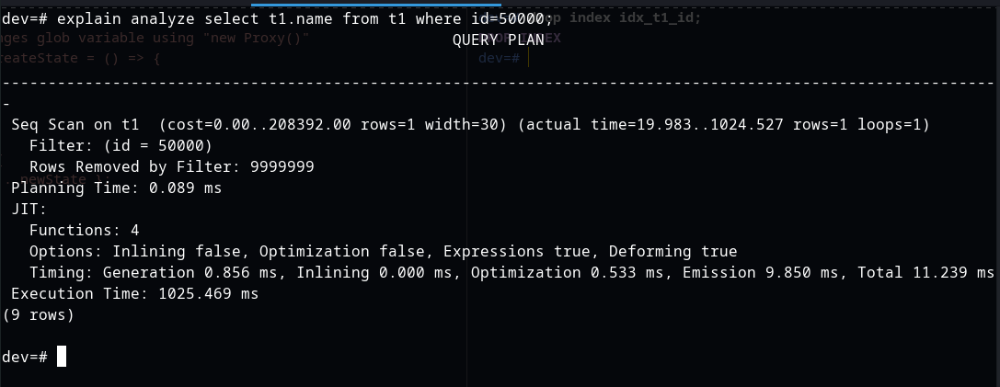
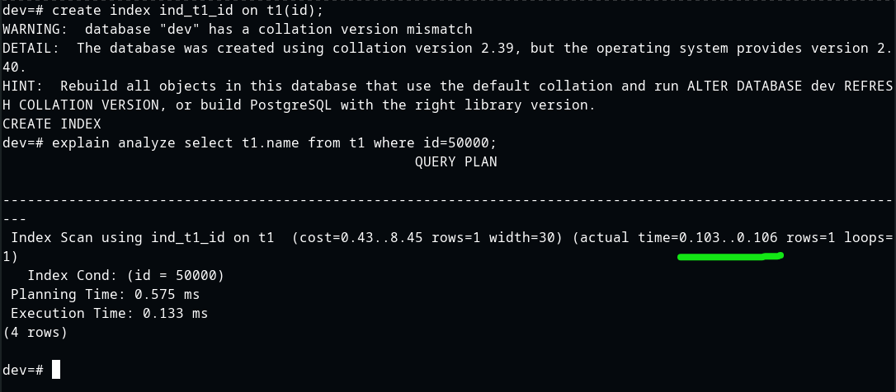

# psql-performance-engineer
Решение заданий по направлению "Performance engineer"

### [1] ускорить простой запроc, добиться времени выполнения < 10ms
``` sql
select name from t1 where id = 50000;
```
### Решение
Создаю индекс для колонки id
``` sql
create index ind_t1_id on t1(id);
```
_**Без индекса**_



_**С индексом**_



